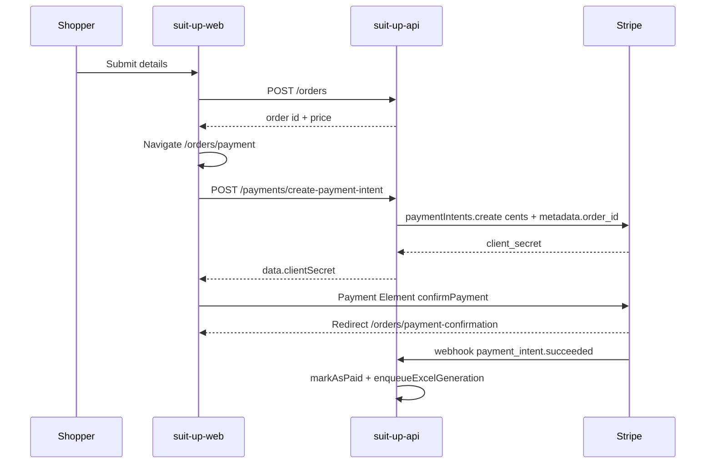
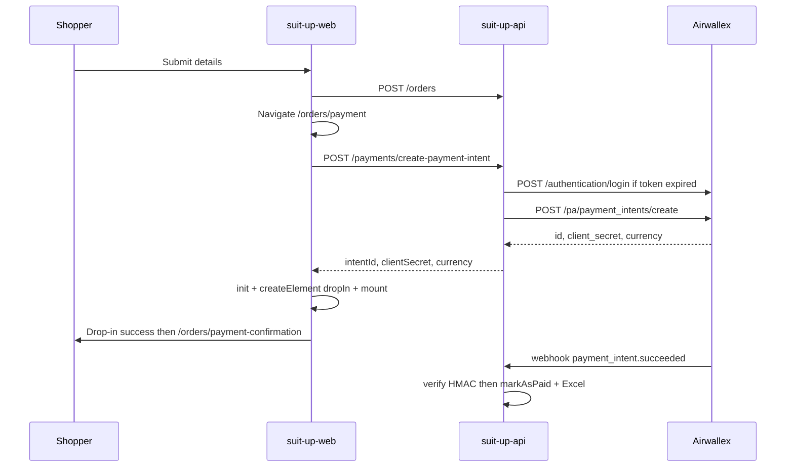

# Stripe → Airwallex mapping

Source of truth for migrating SuitUp from Stripe PaymentIntents to Airwallex PaymentIntents + Drop-in. Later tasks on `feat/airwallex-migration` should follow this document.

Companion frontend repo: `suit-up-web` (same branch name).

Official Airwallex docs:

- [Create a PaymentIntent](https://www.airwallex.com/docs/api/payments/payment_intents/create)
- [Drop-in guest checkout](https://www.airwallex.com/docs/payments/integration-options/web-checkout/drop-in-element/guest-user-checkout)
- [Listen for webhook events](https://www.airwallex.com/docs/developer-tools/webhooks/listen-for-webhook-events)

---

## Current live Stripe flow

The production path is **PaymentIntents + Payment Element**. Stripe Checkout Session exists in the API but the web app does **not** call it.

### Backend (live)

- Client: `src/utils/stripe.ts` — `stripe` SDK, secret key, API version `2026-05-27.dahlia`
- Create PI: `src/modules/payments/services/payments.service.ts` `createPaymentIntent` — `amount` (cents), `currency` default `usd`, `metadata.order_id`
- Route: `POST /api/v1/payments/create-payment-intent` → `{ data: { clientSecret } }`
- Input schema: `src/modules/payments/validations/create‑payment-intent.schema.ts` — `amount > 0`, optional `usd | cny`, `orderId`
- Unused: `POST /payments/create-checkout-session` (`ui_mode: embedded_page`) — **not used by the frontend**
- Webhook: registered **before** `express.json` in `src/app.ts` with `express.raw`, verifies `stripe-signature` via `constructEvent`
- On `payment_intent.succeeded`: load order from `metadata.order_id` → `markAsPaid` (idempotent via `is_paid`) → `enqueueExcelGeneration`
- On `payment_intent.payment_failed`: log only
- Env: `STRIPE_SECRET_KEY`, `STRIPE_WEBHOOK_SECRET`; Render: `render.yaml`
- Order model: boolean `isPaid` only — **no payment intent id column**

### Frontend (live)

- Checkout: `suit-up-web/app/orders/payment/checkout-client.tsx`
- Amount sent: `Math.round((orderPrice * 1.08) * 100)` cents; tax exists **only on the client** (`NEXT_PUBLIC_TAX_RATE` default 0.08)
- Packages: `@stripe/stripe-js`, `@stripe/react-stripe-js`; unused `stripe` npm package
- Confirm: `stripe.confirmPayment` with `return_url` → `/orders/payment-confirmation`
- Confirmation page still looks for Checkout `session_id` (legacy); Payment Element actually appends `payment_intent` / `redirect_status`
- Dead code: `PaymentSchema` (`stripe | paypal | alipay | applepay`) is unused by the live checkout

### Out of scope (not implemented today)

Refunds, saved cards, Stripe Customer, Connect, Billing, subscriptions, Stripe Tax.

---

## Airwallex target (PaymentIntent + Drop-in)

Official flow: authenticate → create PaymentIntent on the server → Drop-in with `intent_id` + `client_secret` + `currency` → fulfill from `payment_intent.succeeded` webhook (do not trust client `success` alone).

---

## Field-by-field mapping

### Auth

| Stripe | Airwallex |
| --- | --- |
| Long-lived `STRIPE_SECRET_KEY` in SDK | `POST /api/v1/authentication/login` with `x-client-id` + `x-api-key` → Bearer token (~30 min) |

Cache the token on the server and reuse until `expires_at`. Never expose client id or API key to the browser.

### Create PaymentIntent

| Stripe | Airwallex |
| --- | --- |
| `amount` in **cents** (integer) | `amount` in **major units** (e.g. `10.99`, not `1099`). **Highest-risk mismatch.** |
| `currency: 'usd'` | `'USD'` (ISO 4217 uppercase) |
| `metadata.order_id` | `merchant_order_id` (string of order id) **and** `metadata.order_id` for webhook lookup |
| No `request_id` | Unique `request_id` (UUID) required for idempotency |
| Returns `client_secret` only | Drop-in needs **`id` + `client_secret` + `currency`**. Expand API response accordingly. |
| Checkout Session `return_url` | `return_url` = `{FRONTEND_BASE_URL}/orders/payment-confirmation?orderId={id}` (needed if Drop-in shows redirect methods) |

### Checkout UI

| Stripe | Airwallex |
| --- | --- |
| `@stripe/react-stripe-js` `Elements` + `PaymentElement` + `confirmPayment` | `@airwallex/components-sdk` `init({ env, enabledElements: ['payments'] })` + `createElement('dropIn', { intent_id, client_secret, currency })` + `mount` + `on('ready'\|'success'\|'error')` |
| Auto-redirects on success | `success` handler should `router.push('/orders/payment-confirmation')` (and handle redirect methods via `return_url`) |
| Publishable key | SDK env only: sandbox `demo`, production `prod` |

### Webhooks

| Stripe | Airwallex |
| --- | --- |
| Header `stripe-signature` | `x-timestamp` + `x-signature` |
| `constructEvent` | HMAC-SHA256 of `timestamp + rawBody` with webhook secret (keep raw-body route **before** `express.json`) |
| Event field `type` | Event field `name` |
| `payment_intent.succeeded` | Same name → same `markAsPaid` + Excel |
| Order from `metadata.order_id` | Resolve via `merchant_order_id` then `metadata.order_id` |
| `payment_intent.payment_failed` | **Does not exist** → log `payment_intent.cancelled`; client `error` covers declines |

Also ignore/log: `created`, `requires_payment_method`, `requires_customer_action`, `pending`. There is no Airwallex Node `constructEvent`; implement HMAC in our service.

### Config (task 6)

**API**

- `AIRWALLEX_CLIENT_ID`
- `AIRWALLEX_API_KEY`
- `AIRWALLEX_BASE_URL` (`https://api.sandbox.airwallex.com` vs `https://api.airwallex.com`)
- `AIRWALLEX_WEBHOOK_SECRET`

**Web**

- `NEXT_PUBLIC_AIRWALLEX_ENV` (`demo` \| `prod`) — **no publishable key**

Remove Stripe env vars and Render keys once cutover is complete.

---

## Recommended contract changes

These are mapping decisions for later tasks, not implemented in task 1:

1. **Charge amount on the server.** Today the client sends cents (tamperable) and tax exists only in the web app. Later: look up the order, compute `price * (1 + taxRate)` in major units, ignore client amount (or drop `amount` from the DTO). Put tax rate in API env so webhook/charge and UI stay consistent.
2. **Remove unused Checkout Session** endpoint/service — it is not the PaymentIntent/Drop-in path.
3. **Keep `POST /payments/create-payment-intent`** so the frontend service stays a small change; return `{ intentId, clientSecret, currency }`.
4. **Optionally persist `paymentIntentId` on `orders`** when creating the intent (helps webhook fallback and support). Not required if `merchant_order_id` is always set.
5. **Leave `PaymentSchema` dead** until a later cleanup; live checkout does not use it.
6. **USD first.** Keep optional `cny` in the schema; Drop-in methods come from the Airwallex dashboard, not from our enum.

---

## Inventory for later tasks

| Later task | Stripe surface | Airwallex replacement |
| --- | --- | --- |
| 2 Auth/API service | `src/utils/stripe.ts` | New `src/utils/airwallex.ts`: login, token cache, PA HTTP client |
| 3 PaymentIntent/order | `payments.service.ts` `createPaymentIntent`, schema, swagger | Create PI with major units, `request_id`, `merchant_order_id`; drop Checkout Session |
| 4 Drop-in checkout | `suit-up-web` `checkout-client.tsx`, `orders.service.ts`, packages | `@airwallex/components-sdk` Drop-in; confirmation URL params |
| 5 Webhooks | `handleWebhook` in `payments.controller.ts` | HMAC verify; `name` switch; same `markAsPaid` |
| 6 Config/deploy | `.env.example`, `render.yaml`, web env | Airwallex keys; dashboard webhook URL; enable payment methods |
| 7 QA | none (no payment tests today) | Sandbox cards, 3DS, failed pay, webhook idempotency, Excel after paid |

**Manual steps (task 6, not now):** Airwallex sandbox account, API keys, enable card (and any wallets), register webhook `https://<api>/api/v1/payments/webhook` for `payment_intent.succeeded` / `payment_intent.cancelled`.
